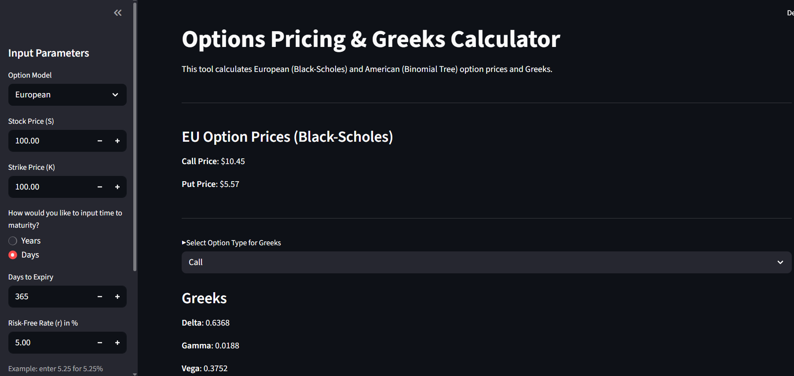

# Options Pricing & Greeks Calculator

This tool is a web-based application built with Streamlit that calculates **European** and **American** option prices and their associated **Greeks**. It supports:

- **European Options** via the Black-Scholes model  
- **American Options** via a Binomial Tree method  
- Real-time calculation of **Delta**, **Gamma**, **Vega**, **Theta**, and **Rho**  
- A dynamic heatmap of option prices across a range of stock prices and volatilities

---

## Features

- **Model Selection**: Choose between European or American option models  
- **Custom Inputs**: Stock price, strike price, time to expiry (in years or days), risk-free rate, volatility, and binomial steps  
- **Greek Calculations**: Intuitive breakdown and real-time computation of the five key option Greeks  
- **Visual Heatmap**: Visualize option price sensitivity with respect to stock price and volatility  
- **Desktop CLI Support**: Use `main.py` for quick command-line-based calculation and explanations  

> **Planned Feature**:  
> **PnL Heatmap** to simulate gains/losses across strategies or market conditions

---

## Tools Used

- `Python`  
- `Streamlit` — for the UI  
- `NumPy`, `SciPy`, `Matplotlib` — for financial computations and visualizations

---

## Installation

Clone the repository and install dependencies:

```bash
git clone https://github.com/DanielCho32/option_calc.git
cd option_calc
pip install -r requirements.txt
streamlit run app.py
```

---

## License

This project is licensed under the MIT License. See the [LICENSE](LICENSE) file for details.

---

## UI Snapshot



---

## Contact

📧 cho.daniel32@gmail.com
